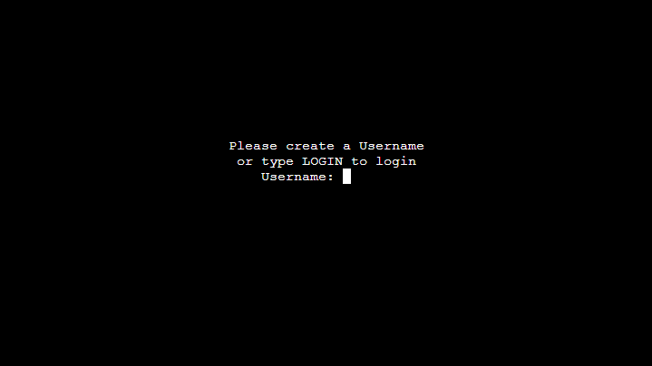
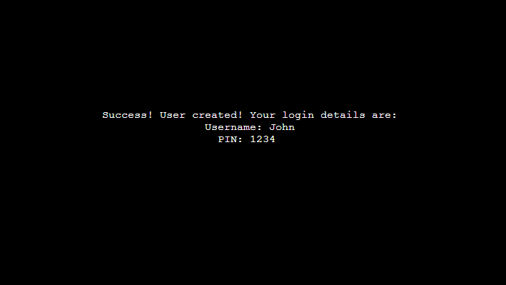
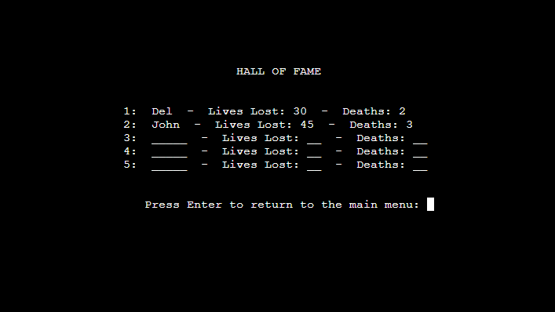

# Fruit Hunter

Fruit hunter is a Python terminal game, which runs on a mock terminal on Heroku.

User's try to find all the fruit by playing a hangman style game.

## How to play

Fruit Hunter is based on the classic game hangman except every word to be guessed is a fruit. There are 15 different fruits to find. Each time the user guesses a new fruit it is added to their collection. Once all fruits are collected the game is won and the users score is added to the hall of fame.

## Design 

I used [lucidchart.com](https://lucid.co/) to help design the project and create the following flow charts. 

### The main menu flow chart :

### The gameplay flow chart :

## Features

### Welcome page

- The welcome page will display the name of the game and ask the user if they have played before.
- Depending on the user's choice they are directed to either the login or create user page.

### Create user page
- The create user page prompts the user to create a log-in username and a 4 digit pin code.
- If the user has made a mistake at the welcome screen and instead wants to log in they can type 'login' to be directed to the login page. 

- It will check to make sure the username is not already taken before completing.

- It will also not allow the user to create a login name over 15 characters long, or to input nothing.

- It will also verify the user's pin code before allowing the user's info to be created.

- Once the user has chosen a valid name and pin code their user details will be created and uploaded to google sheets.
- The user will then be logged in and sent to the main menu.

### Log in page
- The log in page will ask the user for their log in name and pin code.

- If the user's name does not exist it will ask the user if they want to create a new login.

- If the user's pin is incorrect it will notify the user and restart the login.

- If the user's name is recognised and the pin is correct the user will be logged in and sent to the main menu.

### Main menu
- The main menu will have 5 options that direct the user to where they want to go.

### How to play page

- The how to play page shows the user the rules of the game. Hitting enter cycles through each point.

### Fruits collected page
- The fruits collected page will display a list of all the fruits the user has collected, if any, and informs the user how many more fruits they have yet to find.

- If the user has found all the fruits they can reset the list and play again from here.

### Hall of Fame page
- The hall of fame page shows a list of the top 5 users that have collected all fruit.
- The list will sort the users from least amount of lives lost to most.

### Game play 
- When playing the game the user's play area consists of: 
    - A 'lives' display which shows filled hearts which deplete when an incorrect answer is given.
    - Underscores representing how many letters are left to discover in the word.
    - A user input area where the user inputs their answers.
    - Feedback that informs if the user has answered correctly or if they've tried a letter twice.

- The user can guess one letter at a time or they can try to guess the whole word in one.

- If all lives are lost the game ends and the user is asked if they'd like to try again. This will generate a new fruit from the remaining fruit needed to be found.

- If the user guesses all letters in the word, or guesses the word itself, then the game is won and the fruit they found is added to their user's info in google sheets.

- If the user has gathered all the fruit and tries to play a game, a message appears informing them that they have collected all the fruit and to check to see if they've reached the hall of fame. They will also be asked if they would like to reset the list and play again.

