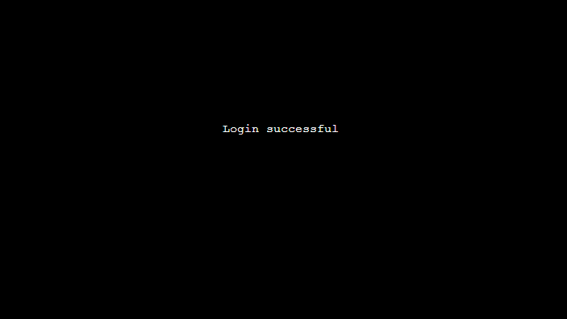
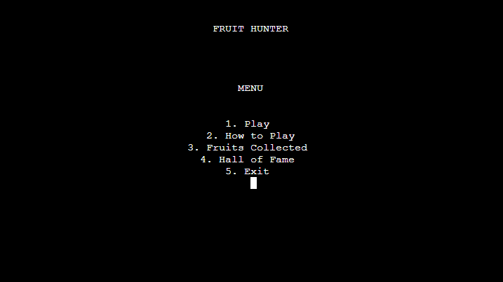
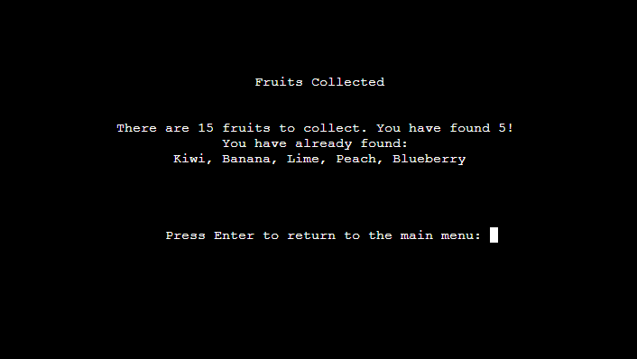
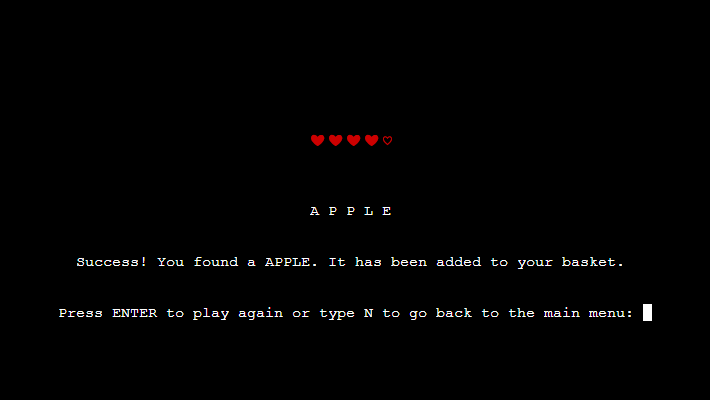

# Fruit Hunter

Fruit hunter is a Python terminal game, which runs on a mock terminal on Heroku.

User's try to find all the fruit by playing a hangman style game. There are 15 different fruits to find. Each time the user guesses a new fruit it is added to their collection. Once all fruits are collected the game is won and the users score is added to the hall of fame.

## Contents 

- [Design](#design)
    * [The main menu flow chart](#main-menu-flow-chart)
    * [The gameplay flow chart](#gameplay-flow-chart)
- [Features](#features)
    * [Welcome Page](#welcome-page)
    * [Create user page](#create-user-page)
    * [Log in page](#log-in-page)
    * [Main Meny](#main-menu)
    * [How to play page](#how-to-play-page)
    * [Fruits collected page](#fruits-collected-page)
    * [Hall of fame page](#hall-of-fame-page)
    * [Game play](#game-play)
    * [Future Features](#future-features)
- [Testing](#testing)
- [Bugs](#bugs)
    * [Solved Bugs](#solved-bugs)
    * [Unsolved Bugs](#unsolved-bugs)
- [Deployment](#deployment)
    * [Steps for deployment](#steps-for-deployment)
        * [Setting up google sheets API](#setting-up-google-sheets-api)
        * [Setting up Heroku](#setting-up-heroku)
- [Credits](#credits)

## Design 

I used [lucidchart.com](https://lucid.co/) to help design the project and create the following flow charts. 

### Main menu flow chart :

### Gameplay flow chart :

## Features

### Welcome page

- The welcome page will display the name of the game and ask the user if they have played before.
- Depending on the user's choice they are directed to either the login or create user page.

### Create user page
- The create user page prompts the user to create a log-in username and a 4 digit pin code.
- If the user has made a mistake at the welcome screen and instead wants to log in they can type 'login' to be directed to the login page. 
- Once verified the users chosen username and pin number is stored on a google sheet.

- It will check to make sure the username is not already taken before completing.

- It will also not allow the user to create a login name over 15 characters long, or to input nothing.

- It will also verify the user's pin code before allowing the user's info to be created.

- Once the user has chosen a valid name and pin code their user details will be created and uploaded to google sheets.
- The user will then be logged in and sent to the main menu.

### Log in page
- The log in page will ask the user for their log in name and pin code.
- The users inputs will be used to match the information that was stored on a google sheet when the user created a login.

- If the user's name does not exist it will ask the user if they want to create a new login.

- If the user's pin is incorrect it will notify the user and restart the login.

- If the user's name is recognised and the pin is correct the user will be logged in and sent to the main menu.

### Main menu
- The main menu will have 5 options that direct the user to where they want to go.

### How to play page
- The how to play page shows the user the rules of the game. Hitting enter cycles through each point.

### Fruits collected page
- Everytime the user collects a fruit when playing, the fruit will be added to their information in google sheets.
- The fruits collected page will display a list of all the fruits the user has collected, if any, and informs the user how many more fruits they have yet to find.

- If the user has found all the fruits they can reset the list and play again from here.

### Hall of Fame page
- Once the user has collected all the fruit they are added to a google sheet which notes how many lives they lost and how many times they died.
- The hall of fame page shows a list of the top 5 users that have collected all fruit.
- The list will sort the users from least amount of lives lost to most.

### Game play 
- When playing the game the user's play area consists of: 
    - A 'lives' display which shows filled hearts which deplete when an incorrect answer is given.
    - Underscores representing how many letters are left to discover in the word.
    - A user input area where the user inputs their answers.
    - Feedback that informs if the user has answered correctly or if they've tried a letter twice.

- The user can guess one letter at a time or they can try to guess the whole word in one.

- If all lives are lost the game ends and the user is asked if they'd like to try again. This will generate a new fruit from the remaining fruit needed to be found.

- If the user guesses all letters in the word, or guesses the word itself, then the game is won and the fruit they found is added to their user's info in google sheets.

- If the user has gathered all the fruit and tries to play a game, a message appears informing them that they have collected all the fruit and to check to see if they've reached the hall of fame. They will also be asked if they would like to reset the list and play again.

### Future Features

- Enable user to spend a life for a hint, or multiple lives to solve a letter.
- Different difficulty modes. Harder would entail less lives or if the player dies the fruits collected list is reset.

## Testing

I have tested this project by running the code through a validator at [Pep8online.com](http://pep8online.com/), which showed no faults.

I have also manually tested the game by trying to input invalid characters as well as trying to leave the input blank, or by inputting too many characters at any point where the user is asked for an input.

I have also asked friends, family, and anybody with the code institute on slack to try and find any bugs within the game.

I also checked that the google worksheets were updating correctly when a users login was created, and when a user was entered into the hall of fame which uses a separate worksheet.

## Bugs

### Solved Bugs

- The length of the fruits collected list would always be one over. This is because when the user is created in the create_user function the cell containing the fruits collected could not be left blank, so you would have to input an empty string. This would then be read as an entry meaning the length of the list would always read that empty string as 1. Fixed this issue by removing the blank string with the line 'fruits_coll_li.remove('')'.

- When creating the game I originally had no spaces between the underscores where the unsolved word was displayed. I found that this was hard for the user to distinguish how many letters were in the word, so I inserted a space in between each underscore. This introduced a bug where the game wouldn't end if you guessed each letter of the word individually. This was because in order for the game to recognise that you had guessed the word I had an if statement that read 'if answer == fruit', so that if anytime the answer that was being updated with each guess matched the fruit trying to be guessed then you would win. But because I now had put spaces in between the characters the answer would never match the fruit exactly. I solved this by changing what the game was looking for to determine a correct answer. I updated the if statement to see if there were no underscores left in the answer, as that would also mean every letter had been discovered. 

- When creating a new user if the pins didn't match the user would be asked again for the pin. On this second go the user could create a pin of any length with any characters. This happened because I had forgotten to insert the same while loop that checked the pins length and to make sure it was only numbers.

- When creating a new user you could enter the same name as an existing user if you capitalise the first letter. Fixed by using the .lower() method on the users input to check against the names on google sheets.

- Originally I had the code to update the lives display inside the play function but found that it wouldnt update correctly. I ran print logs to check that the lives and lives lost counter was updating correctly which they were but it wasn't transferring over to the display. I couldn't figure out why but once I had created the update_game_screen function and implemented the lives display into it, it worked fine.

- When creating the hall of fame function the game would crash if there weren't at least 5 names to be displayed. This was because the game is trying to retrieve information from google sheets that is not there. I fixed this by creating an if and a for loop. Which stated that if the length of all the information gathered was less than 5 (meaning there were less than 5 entries on google sheets), to append the list with blank information until there are 5 entries.

- When guessing the word as a whole I noticed that the gaps between the letters would dissapear. So instead of displaying like this 'A P P L E' it would display like this 'APPLE'. It was a very subtle change but it bugged me. No pun intended. This was happening because I had the code 'answer = fruit' if you guessed the word right, so that the display would change to the word you're trying to guess. I fixed this by inputting a simple 'for loop' that ran through the letters of the fruit, adding an extra space to each one, and then updating the answer.

### Unsolved Bugs

- No bugs remaining.

## Deployment

This project was deployed using Code Institute's mock terminal for Heroku and links to a Google Sheet API.

### Steps for deployment

#### Setting up google sheets API

1. Head to https://console.cloud.google.com/ and sign in or create a free google account.
2. From the google cloud platform dashboard click 'Select a new project'. Then select 'New project'.
3. Create a name for your project under 'Project name' then click 'Create'.
4. This should bring up a box with your project in. Underneath click 'SELECT PROJECT'.
5. From the sidebar navigate to 'APIs and services', 'Library'.
6. In the search bar search for google drive.
7. Select 'Google drive API' and click 'ENABLE'.
8. Click the 'CREATE CREDENTIALS' button located to the top right of the page.
9. From the dropdown menu under 'Which API are you using?' select 'Google drive API'.
10. Under 'What data will you be accessing' choose 'Application data'.
11. Under 'Are you planning to use this API with Compute Engine, Kubernetes Engine, App Engine or Cloud Functions?' select 'No, i'm not using them' and click 'NEXT'.
12. Enter a Service Account Name. You can name it whatever you like. I would suggest naming it the same as what you named your project. Then click 'CREATE AND CONTINUE'.
13. In the 'Role' dropdown menu select 'Basic', 'Editor', then click 'Continue'.
14. The next page can be left blank so just click 'DONE'.
15. Under 'Service Accounts' find the account you just created and click it.
16. Navigate to the 'KEYS' tab and click 'ADD KEY', 'Create new key'. Select 'JSON' and click 'CREATE'.
17. This will download a json file to your machine. This normally downloads into your 'downloads' folder but if you're unsure you can right click the file once it's downloaded and click 'show in folder' to locate it.
18. Next we will have to link the Google Sheets API. To do this navigate back to the library by clicking on the burger icon in the top left hand corner and selecting 'APIs and services', 'Library' from the dropdown menu.
19. In the search bar search for 'Google Sheets' and select 'Google Sheets API' and click 'ENABLE'.
20. Now, using a programme like Gitpod open or create a repository.
21. Drag and drop the json file that you downloaded earlier into your workspace. Rename this file to 'creds.json'.
22. Open the file and copy the email address under 'client_email' without the quotation marks.
23. Open up the google sheet you want to use and click the 'Share' button.
24. Paste in the client email. Make sure 'Editor' is selected, untick 'Notify people' and then click 'Share'.
25. To protect sensitive information be sure to add your creds.json file to your gitignore file inside your editor.
26. In order to use our google sheets API you need to install two additional dependencies into your project. To do this, inside your python workspace on the first line input 'import gspread' and on the line beneath input 'from google.oauth2.service_account import Credentials'.
27. Underneath the two imports copy and paste this code, inserting the name of your google spreadsheet where it says 'google_sheet_name_here'.

    SCOPE = [
        "https://www.googleapis.com/auth/spreadsheets",
        "https://www.googleapis.com/auth/drive.file",
        "https://www.googleapis.com/auth/drive"
        ]

    CREDS = Credentials.from_service_account_file('creds.json')
    SCOPED_CREDS = CREDS.with_scopes(SCOPE)
    GSPREAD_CLIENT = gspread.authorize(SCOPED_CREDS)
    SHEET = GSPREAD_CLIENT.open('google_sheet_name_here')

28. Your APIs will now be linked to your project.

#### Setting up heroku

1. If your requirements.txt file has not changed you can skip this step. Otherwise, in your terminal type 'pip3 freeze > requirements.txt' then save and push the changes.
2. Go to Heroku.com and sign in or create a free account.
3. From the heroku dashboard click the 'Create new app' button.
4. Name the app something unique and choose what region you are in then click 'Create app'.
5. Go to the settings tab and find the Config Vars section. Click 'Reveal Config Vars'.
6. If your project does not use a creds.json file then skip this step. Otherwise, in the field for KEY enter the value CREDS in all capitals. In the field for VALUE copy and paste the entire contents of your creds.json file from your project. Then click 'Add'.
7. In the field for KEY enter PORT in all capitals, then in the field for VALUE enter 8000. Then click 'Add'.
8. Scroll down to the Buildpacks section and click 'Add buildpack'.
9. Click Python then save changes.
10. Add another buildpack by clicking 'Add buildpack' and this time click Nodejs then save changes.
11. Make sure that Python appears above Nodejs in the buildpack section. If it does not you can click and drag them to change the order.
12. Then head over to the deploy section by clicking deploy from the nav bar at the top of the page.
13. From the 'Deployment method' section select GitHub and click 'Connect to GitHub'.
14. Enter the repository name as it is in GitHub and click 'search'.
15. Click the 'connect' button next to the repository to link it to heroku.
16. To deploy, scroll down and click the 'Deploy Branch' button.
17. Heroku will notify you that the app was successfully deployed with a button to view the app.
18. If you want to rebuild your app automatically you can also select the 'Enable Automatic Deploys' button which will then rebuild the app every time you push any changes.

## Credits

- The code linking the APIs is credited to [The Code Institute](codeinstitute.net) from their 'Love Sandwiches' project.
- The code to clear the console is credited to [Stackoverflow.com](https://stackoverflow.com/questions/2084508/clear-terminal-in-python).
- The code to sort a list of lists by its second entry is credited to [Geeksforgeeks.org](https://www.geeksforgeeks.org/python-sort-list-according-second-element-sublist/)
- Credit goes to daisygunn_5p at The Code Institute for helping me figure out how to update single cells in google sheets.
