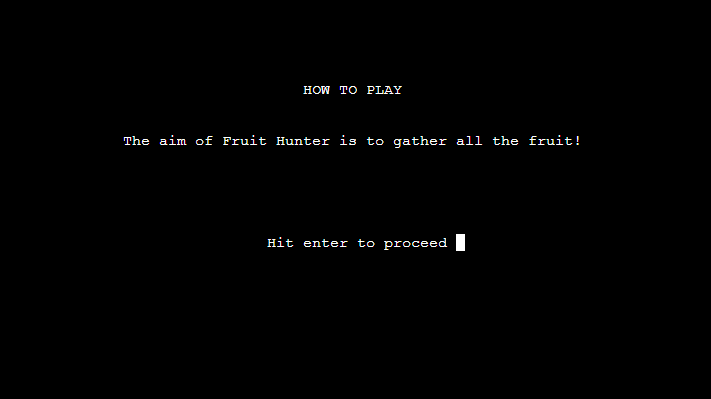
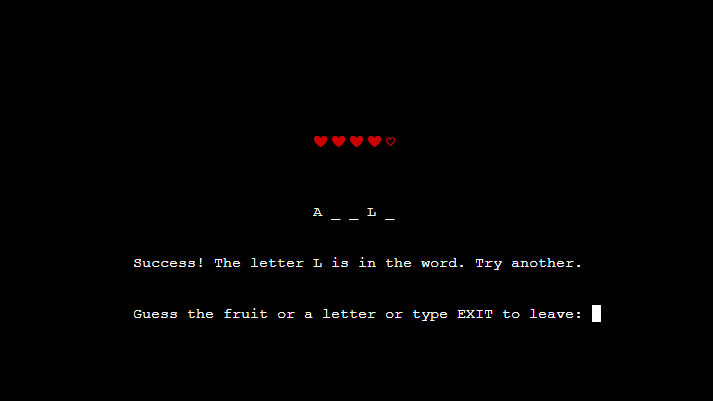

# Fruit Hunter - Testing

## Contents 

- [Validators](#validators)
- [User stories testing](#user-stories-testing)
- [Feature Testing](#feature-testing)
    * [Create user page](#create-user-page)
    * [Login page](#login-page)
    * [Main Menu](#main-menu)
    * [Game play](#game-play)
    * [How to play](#how-to-play)
    * [Fruits collected](#fruits-collected)
    * [Hall of fame](#hall-of-fame)    
- [Further Testing](#further-testing)
- [Bugs](#bugs)
    * [Solved Bugs](#solved-bugs)
    * [Unsolved Bugs](#unsolved-bugs)

## Validators

I have tested this project by running the code through a validator at [Pep8online.com](http://pep8online.com/), which showed no faults.

## User stories testing

*As a user I want to be able to understand the rules of the game.*
- From the main menu users can access the 'How to play' screen which explains the rules of the game.

*As a user I want the game to be intuitive.*
- The user is guided through every step of the create user and login process with clear concise questions.

- Any wrong input from the user is met with an error message explaining their mistake and re-asking the question.

- The menu is simplistic and the options are clearly labelled.

- During gameplay the user is guided with what to do next and has constant feedback after their actions.

- Minimal inputs are needed when questions are asked and in some cases any key will perform the correct function, like leaving a menu that has no other options inside.

*As a user I want feedback on my progress.*
- The 'Collected Fruits' screen from the main menu lists all fruits you have found and shows you how many in total are left to find.

- In gameplay there is a visual representation of the letters you have guessed correctly and a lives display which updates everytime you answer incorrectly.

- If you have completed the game you may find your overall score in the 'Hall of Fame' screen if you managed to score high enough. 

*As a user I want to be able to save my progress.*
- The user is asked at the very beginning to create a login username and PIN code.

- Once the user has a login the game will record all their found fruits along with lives losts and deaths.

## Feature testing

### Welcome Page
- Inputting anything other than Y or N informs the user 'You must choose Y or N'.
- If the user chooses 'Y' they are directed to the login page as intended.
- If the user chooses 'N' they are directed to the create user page as intended.
- Any blank space before or after input is ignored.

### Create user Page
- Selecting a username that already exists notifies the user that the name is already taken.
- Leaving the username blank warns the user that their name cannot be blank.
- Entering numbers or any special character within the username notifies the user that only letters are allowed.
- Entering a username above 15 characters long notifies the user that the name chosen is too long.
- Entering a username will always display the name back to the user in lower case with the first letter capitalised regardless of what the case was when entered.  
- When verifying the username the create user function will start over if the user inputs anything other than 'Y'.
- Any blank spaces during name vaidation are ignored.
- If the user verifies their chosen name they are then instructed to choose a PIN as intended.
- If the user enters letters as a PIN, has a PIN longer than 4 digits, or leaves the PIN blank they are notified that the PIN must be 4 digits long and consist only of numbers.
- If the verified PIN does not match the chosen PIN then the chosen PIN process is restarted.
- Once the chosen PIN and verified PIN match the user is taken to the main menu as intended.
- Entering a username as LOGIN (not case sensitive) will take the user to the login page as intended.
- The users worksheet in google sheets is correctly updated with username and PIN when user is created.

### Login Page
- Entering any name that does not exist notifies the user that the name they've chosen does not exists and asks them whether they would like to create a user login.
- If the user is asked whether they would like to create a user login and they choose 'Y' they are taken to the create user page as intended. If they choose 'N', the login page is restarted. Any other input notifies the user that the input is invalid and restarts the login page.
- Entering a name that would of been invalid when creating a user notifies the user that the name is invalid.
- Entering a name that exists regardless of case will then ask you for your PIN.
- Entering anything other than the correct PIN number will notify the user that the PIN was incorrect and take them back to the beginning of the login page.
- Entering spaces before or after username entry will be ignored.
- A succesful PIN will take the user to the main menu as intended.
- PINS are matched successfully to the right user by pulling the correct cells from the users worksheet in google sheets.

### Main Menu
- Any input other than the numbers 1-5 will notify the user that the input is not recognised and to try again.
- Any blank space before or after input is ignored.
- Every option on the menu takes the user to the correct screen.

### Game Play
- Leaving the input blank will notify the user that they didn't submit anything and to try again.
- Entering either 2 or 3 letters will notify the user that they must guess one letter at a time or the whole word.
- Any blank space before or after input is ignored.
- Entering a number or special character will notify the user that only letters are allowed.
- Entering one letter regardless of case will either notify the user that the chosen letter is in the word or not.
- Entering a letter that you have already chosen informs the user that they've already guessed that letter and to try again.
- Entering EXIT in any case will return the user to the main menu as intended.
- If the letter chosen is correct then any underscores that represent that letter will update to show this.
- If the chosen letter is not in the word the lives display will update to show one less.
- Entering more than one letter will register as the user trying to guess the whole word as intended.
- If the users guess is incorrect they will be notified that it is not the word and the lives display will update to show one less.
- If users guess is correct or there are no more letters left to guess then they are notified that they were successfull and asked if they want to play again. Any input other than 'ENTER' or 'N' will inform the user that the character was not recognised and will re-ask the question.
- Hitting ENTER after a successfull round will begin another as intended.
- Selecting 'N' after a successfull round will take the user back to the main menu as intended.
- Losing all lives will display a message informing the user that they have lost and gives them the option to play again or go back to the main menu.
- When the user loses all lives and is asked if they want to play again or exit to the menu, any character other than 'Y' or 'N' informs the user that the character is not recognised and is asked again for an input.
- If the user has collected all the fruit and tries to play a game they will be notified that they have already collected all fruit and if they wish to reset the fruits collected list to play again. If the user types 'RESET' regardless of case,  the list will be reset and another game will begin. If the user hits the ENTER key they will be returned to the menu.
- Confirmed that no fruits appear twice.
- Guessing a fruit updates the correct cell in the users worksheet in google sheets.
- Losing a life updates the correct cell in the users worksheet in google sheets.
- Losing all lives updates the correct cell in the users worksheet in google sheets.
- Guessing all fruits correctly updates the hof worksheet in google sheets.
- ting the list wipes the correct cell in the user worksheet in google sheets.

### How to play
- Hitting ENTER cycles through the rules of how to play and exits when finished as intended. Any typed inputs from the user are ignored.

### Fruits collected
- The fruits collected page closes back to the menu as soon as the user hits ENTER as intended. Any typed inputs from the user are ignored.
- The user is informed if they have 0 fruits collected. 
- If the user has between 1 and 14 fruits the page will inform the user how many fruits they have found and will display each fruit collected. It will only display up to 5 fruits on each line.
- If the user has collected all 15 fruits the page will congratulate the user and ask if they want the list to be reset. Typing RESET regardless of case, notifies the user the list has been reset and takes them back to the menu. Hitting the ENTER key takes the user back to the main menu. Any other input informs the user that it is not recognised and asks the user for an input again.
- Any blank space before or after input is ignored.
- Resetting the list wipes the correct cell in the user worksheet in google sheets.

### Hall of Fame
- ENTER key will return user to main menu regardless of input.
- Hall of fame displays top 5 users in order of lives lost, least to highest, as intended.
- If there are less than 5 people who have reached the hall of fame the game will populate the spaces with underscores.
- Information gathered for the hall of fame is correctly gathered from the hof worksheet in google sheets.

## Further Testing

- I have also asked friends, family, and anybody with The Code Institute on slack to try and find any bugs within the game.

- I also checked that the google worksheets were updating correctly when a users login was created, and when a user was entered into the hall of fame which uses a separate worksheet.

## Bugs

### Solved Bugs

- The length of the fruits collected list would always be one over. This is because when the user is created in the create_user function the cell containing the fruits collected could not be left blank, so you would have to input an empty string. This would then be read as an entry meaning the length of the list would always read that empty string as 1. Fixed this issue by removing the blank string with the line 'fruits_coll_li.remove('')'.

- When creating the game I originally had no spaces between the underscores where the unsolved word was displayed. I found that this was hard for the user to distinguish how many letters were in the word, so I inserted a space in between each underscore. This introduced a bug where the game wouldn't end if you guessed each letter of the word individually. This was because in order for the game to recognise that you had guessed the word I had an if statement that read 'if answer == fruit', so that if anytime the answer that was being updated with each guess matched the fruit trying to be guessed then you would win. But because I now had put spaces in between the characters the answer would never match the fruit exactly. I solved this by changing what the game was looking for to determine a correct answer. I updated the if statement to see if there were no underscores left in the answer, as that would also mean every letter had been discovered. 

- When creating a new user if the pins didn't match the user would be asked again for the pin. On this second go the user could create a pin of any length with any characters. This happened because I had forgotten to insert the same while loop that checked the pins length and to make sure it was only numbers.

- When creating a new user you could enter the same name as an existing user if you capitalise the first letter. Fixed by using the .lower() method on the users input to check against the names on google sheets.

- Originally I had the code to update the lives display inside the play function but found that it wouldnt update correctly. I ran print logs to check that the lives and lives lost counter was updating correctly which they were but it wasn't transferring over to the display. I couldn't figure out why but once I had created the update_game_screen function and implemented the lives display into it, it worked fine.

- When creating the hall of fame function the game would crash if there weren't at least 5 names to be displayed. This was because the game is trying to retrieve information from google sheets that is not there. I fixed this by creating an if and a for loop. Which stated that if the length of all the information gathered was less than 5 (meaning there were less than 5 entries on google sheets), to append the list with blank information until there are 5 entries.

- When guessing the word as a whole I noticed that the gaps between the letters would disappear. So instead of displaying like this 'A P P L E' it would display like this 'APPLE'. It was a very subtle change but it bugged me. No pun intended. This was happening because I had the code 'answer = fruit' if you guessed the word right, so that the display would change to the word you're trying to guess. I fixed this by inputting a simple 'for loop' that ran through the letters of the fruit, adding an extra space to each one, and then updating the answer.

### Unsolved Bugs

- No bugs remaining.